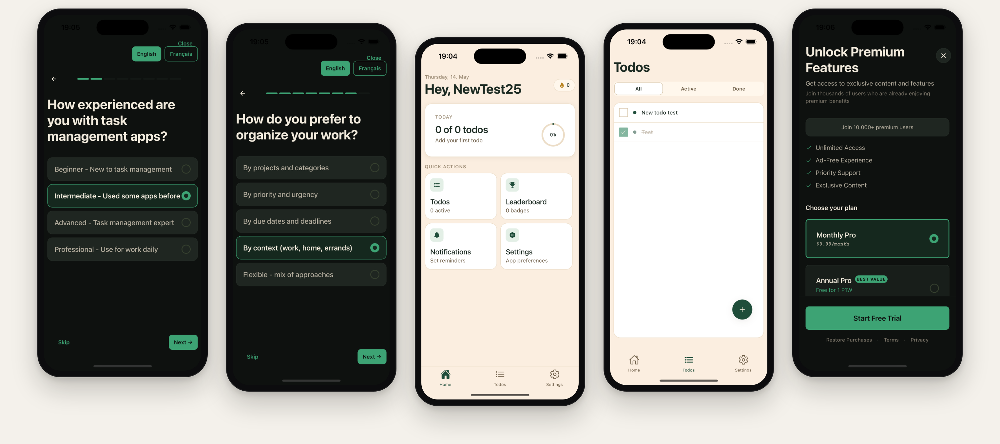
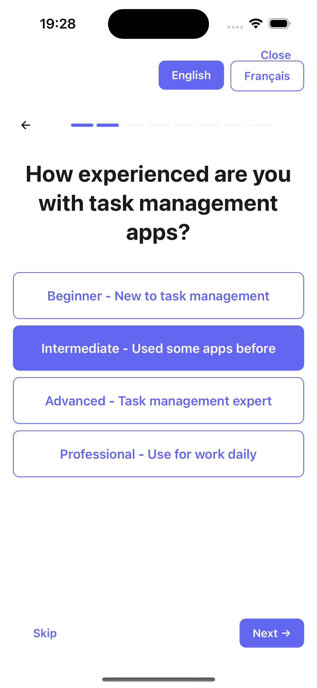
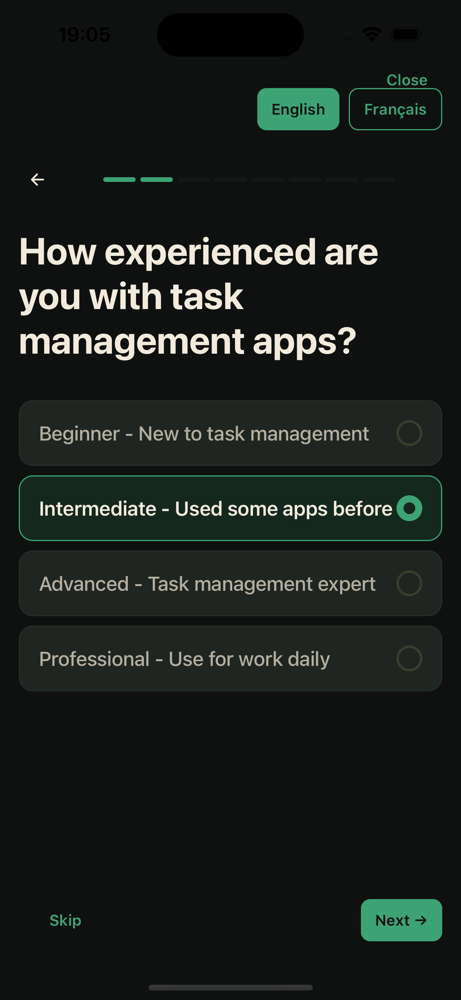
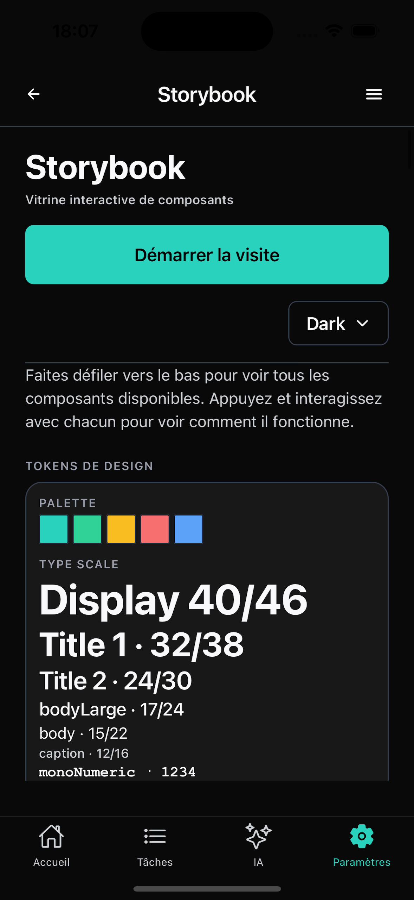

<div align="center">

# claude-design-idea-to-ready

**From a one-line idea to on-brand, shippable design, in the right order.**

A Claude Code skill that front-loads the constraints (design tokens + a `CLAUDE.md` design-rules block) so the model can only produce on-brand UI, then runs generation last and verifies it against the rules.

[](LICENSE)
[](https://github.com/chohra-med/claude_design_skill)

Created by [**Malik Chohra**](https://getwireai.com?utm_source=github&utm_medium=readme&utm_campaign=creator) · [Code Meet AI newsletter](https://codemeetai.substack.com?utm_source=github&utm_medium=readme&utm_campaign=newsletter)

Sponsored by [AI Web Launcher](https://aiweblauncher.com?utm_source=github&utm_medium=readme&utm_campaign=sponsor) and [AI Mobile Launcher](https://aimobilelauncher.com?utm_source=github&utm_medium=readme&utm_campaign=sponsor) and [CasaInnov](https://casainnov.com?utm_source=github&utm_medium=readme&utm_campaign=sponsor)

</div>

---



Most AI-generated UI looks the same because it is handed zero constraints. This skill front-loads the constraints (design tokens + a `CLAUDE.md` design-rules block) so the model can only produce on-brand output, then runs the generation last and verifies it against the rules.

## Before / after

Same screen, same prompt. The difference is the foundation the model was given before it generated.

| Generic (no constraints) | On-brand (this pipeline) |
|---|---|
|  |  |

It works because the brand lives in two files the model reads first:



## The pipeline

0. Idea → brief (one job, who, the one action)
1. **Foundation** — `design/tokens.ts` + a `## Design rules` block in `CLAUDE.md`
2. **Components** — defined against the tokens, before any screen
3. **Screens** — composed from components, one primary action each
4. **Interactions + states** — loading, empty, error, motion
5. **Accessibility** — a pre-generation gate
6. **Generate** with `/design`, reading the tokens
7. **Verify** the output against the design rules, fix, re-run

## Install

**Claude Code (project or user skills):**
```bash
git clone git@github.com-personal:chohra-med/claude_design_skill.git
# then copy into your skills dir, e.g.
cp -r claude_design_skill ~/.claude/skills/claude-design-idea-to-ready
```

Or drop the folder into a UAMOS-style memory bank's `skills/` directory; it composes with the rest and self-triggers on design tasks.

## Files

- `SKILL.md` — the skill (pipeline + triggers)
- `references/foundation-templates.md` — paste-ready tokens + design-rules block
- `references/component-checklist.md` — components + states to define first
- `references/a11y-checklist.md` — the pre-generation accessibility gate
- `references/verify-rules.md` — the post-generation verification checklist

## Sponsored by Code Meet AI

This skill is built and maintained by **[Code Meet AI](https://codemeetai.substack.com/?utm_source=github&utm_medium=readme&utm_campaign=design-skill)** — a newsletter on shipping real products with AI, by [@malik_chohra](https://x.com/malik_chohra).

If it saved you time, the best thanks is a look at what powers it:

- 📬 **Newsletter** → [codemeetai.substack.com](https://codemeetai.substack.com/?utm_source=github&utm_medium=readme&utm_campaign=design-skill)
- 🧩 **Wire RN** (open-source generative-UI SDK) → [getwireai.com](https://getwireai.com/?utm_source=github&utm_medium=readme&utm_campaign=design-skill)
- 📱 **AI Mobile Launcher** (the boilerplate this skill ships inside) → [aimobilelauncher.com](https://aimobilelauncher.com/?utm_source=github&utm_medium=readme&utm_campaign=design-skill)

## License

MIT. By [@malik_chohra](https://x.com/malik_chohra) · [Code Meet AI](https://codemeetai.substack.com/?utm_source=github&utm_medium=readme&utm_campaign=design-skill).

## More from Code Meet AI

**Open source:** [wireai-rn](https://github.com/chohra-med/wireai-rn) · [expo_boilerplate](https://github.com/chohra-med/expo_boilerplate) · [colorway-c-brand](https://github.com/chohra-med/colorway-c-brand)
**Products:** [AI Mobile Launcher](https://aimobilelauncher.com) · [AI Web Launcher](https://aiweblauncher.com) · [Wire AI](https://getwireai.com) · [CasaInnov](https://casainnov.com)
**Follow:** [Newsletter](https://codemeetai.substack.com) · [YouTube](https://youtube.com/@codemeetai)
